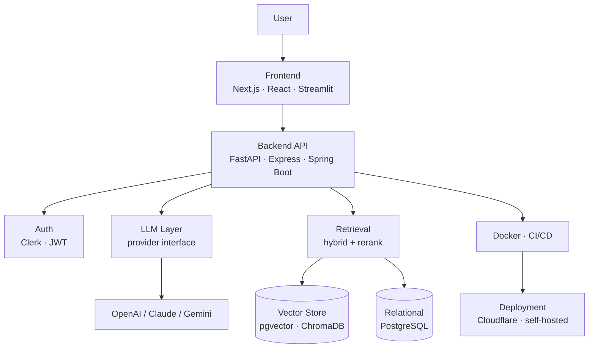
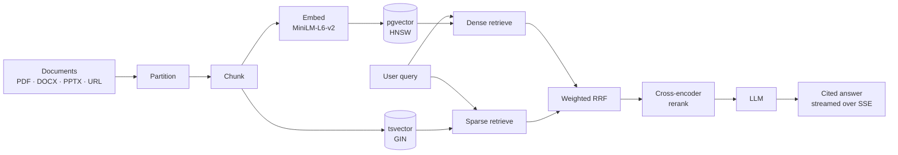

# Hi, I'm Hemant Kushwaha 👋

### Software Developer | AI & RAG Engineer

I build practical software systems where a language model has to survive contact
with real infrastructure — retrieval over private documents, agents that make
decisions mid-conversation, and the auth, storage, container and deployment
layers that make any of it usable by someone other than me.

Six systems below, each built end-to-end: the retrieval or build pipeline **and**
the application around it. MCA graduate based in Pune, India — open to backend
and AI engineering roles.

---

## Engineering Focus

---

## Selected Projects

<table>
<tr>
<td width="50%" valign="top">

### 🔍 RAGForge

**Self-hosted document intelligence.** Upload private documents, ask questions, get answers *with citations*. Multi-tenant from the ground up.

`Python` `FastAPI` `PostgreSQL` `pgvector` `Next.js` `Clerk`

<b>Engineering detail</b>

Retrieval is hybrid, not just vector search. A dense HNSW index and a Postgres
`tsvector`/GIN index are queried in parallel and fused with **weighted Reciprocal
Rank Fusion**, written generically over N ranked lists rather than hardcoded to
two, with optional cross-encoder reranking on top.

Embeddings are L2-normalised at write time so the index can use inner product
(`vector_ip_ops`) instead of cosine — cheaper distance, identical ranking.

**[Repository →](https://github.com/Kushwaha-Hemant/RAGForge-Document_Search)**

</td>
<td width="50%" valign="top">

### 🎙️ InterviewPilot AI

**Adaptive mock interviewer.** Not a fixed question list — every answer is scored against a rubric, and a rule engine decides what happens next.

`Python` `FastAPI` `SQLAlchemy` `PostgreSQL` `OpenAI` `WebSockets`

<b>Engineering detail</b>

The LLM is an advisor, not an authority. `engine._enforce_rules()` takes the
model's suggested next action and **overrides it** when it violates interview
policy, so a hallucinated control decision cannot derail a session.

The provider is an ABC, so the OpenAI SDK is never imported outside its own
implementation. Question generation and the final coach report deliberately run
on different models.

**[Repository →](https://github.com/Kushwaha-Hemant/Interviewpilot_AI)**

</td>
</tr>
<tr>
<td width="50%" valign="top">

### ⚙️ DevFlow

**Self-hosted CI/CD control plane.** Clones repos, runs build stages as real child processes, and drives the Docker Engine socket directly.

`TypeScript` `Express` `Prisma` `PostgreSQL` `Docker` `Socket.IO`

<b>Engineering detail</b>

The integrations are real rather than mocked, and the fiddly parts show it.
Without a TTY, Docker's Engine API prefixes every log line with an 8-byte
header, so the stream is **demultiplexed frame by frame**. Container CPU
percentage is computed the way `docker stats` actually computes it, scaling
`cpuDelta/systemDelta` by online CPU count.

Build logs carry a monotonic per-build sequence number, so a client that
reconnects mid-build resumes without gaps or duplicates.

**[Repository →](https://github.com/Kushwaha-Hemant/Devflow)**

</td>
<td width="50%" valign="top">

### 📄 ResumePilot

**RAG resume analyser.** Scores a resume against a job description, surfaces skill gaps, and exports a PDF report.

`Python` `Streamlit` `LangChain` `ChromaDB` `pydantic`

<b>Engineering detail</b>

Each resume gets its **own ChromaDB collection**, so retrieval never bleeds
between candidates.

The model's reply passes through a three-tier JSON salvage — fenced block, then
raw parse, then repair — before being validated into a 20-field pydantic model,
because an LLM asked for JSON returns almost-JSON often enough to matter.

**[Repository →](https://github.com/Kushwaha-Hemant/ResumePilot)**

</td>
</tr>
<tr>
<td width="50%" valign="top">

### 🌌 DevVerse AI

**Procedural 3D web experiment.** A workspace you explore instead of a page you scroll — built with no 3D assets at all.

`TypeScript` `Next.js 16` `React Three Fiber` `Cloudflare Workers`

<b>Engineering detail</b>

Every mesh and texture in the scene is **generated in code** — there is no
`.glb` file anywhere in the repository.

Quality tier is chosen by reading the actual GPU driver string from a throwaway
WebGL context. Every random value comes from a seeded PRNG, so the scene is
identical on every load, and the render loop stops entirely when the hero is
scrolled out of view.

**[Live ↗](https://devverse-ai.kushwaha-hemant.workers.dev)** · **[Repository →](https://github.com/Kushwaha-Hemant/Devverse_AI)**

</td>
<td width="50%" valign="top">

### 💸 Spendee

**AI personal finance platform.** A monorepo pairing a native Android app with a Spring Boot backend.

`Kotlin` `Jetpack Compose` `Spring Boot` `Java` `Gradle`

<b>Engineering detail</b>

The Android side is split across **16 Gradle modules** with a shared design
system, built to practise modularisation at a scale where it starts to matter.

The JWT layer refuses to start on a secret shorter than 256 bits, or on the
development default outside a dev profile — a length check alone would not catch
the second case.

*Actively in development. The repository README separates what is built today
from what is still scaffolded.*

**[Repository →](https://github.com/Kushwaha-Hemant/Spendee)**

</td>
</tr>
</table>

Every badge above is live. All six repositories run tests, lint and build on
every push — click any badge for the run.

---

## How these systems fit together

Most of the projects above are the same shape: a client, an API, a model call,
a retrieval layer, and somewhere to put the vectors.

<b>The retrieval pipeline, in more detail</b>

 

RAGForge's path from a raw file to a cited answer:

---

## Developer Journey

---

## Currently

- Improving retrieval quality — chunking strategy, hybrid search weighting, and **evaluating** RAG output rather than eyeballing it
- Bringing Spendee's Android and Spring Boot halves to feature parity
- Deepening system design — the part that only shows up once something is running
- Open to backend and AI engineering roles

 

The portrait above is generated from a photograph by <a href="./ascii-portrait"><b>ascii-portrait</b></a> — 
a Python pipeline that maps brightness onto a glyph ramp ordered by <i>measured</i> ink coverage, 
then animates the characters assembling themselves into the image. <a href="./ascii-portrait/README.md">How it works →</a>

  

<picture>
  <source media="(prefers-color-scheme: dark)" srcset="https://raw.githubusercontent.com/Kushwaha-Hemant/Kushwaha-Hemant/output/snake-dark.svg" />
  <source media="(prefers-color-scheme: light)" srcset="https://raw.githubusercontent.com/Kushwaha-Hemant/Kushwaha-Hemant/output/snake.svg" />
  
</picture>

