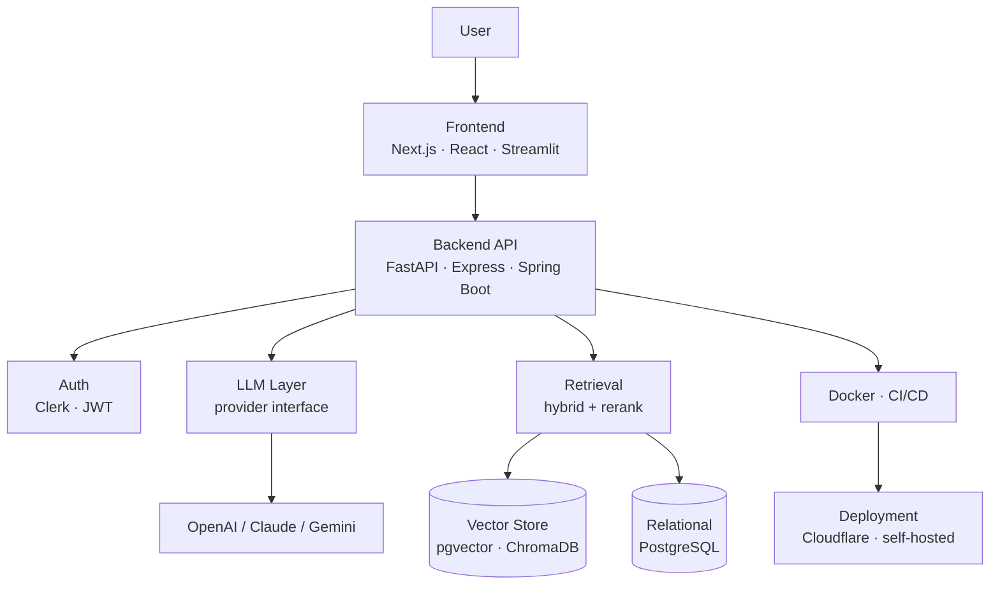
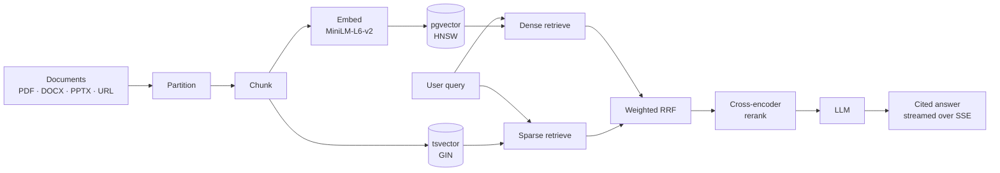

# Hi, I'm Hemant Kushwaha 👋

### Software Developer | AI & RAG Engineer

I build practical software systems where a language model has to survive contact
with real infrastructure — retrieval over private documents, agents that make
decisions mid-conversation, and the auth, storage, container and deployment
layers that make any of it usable by someone other than me.

Six systems below, each built end-to-end: the retrieval or build pipeline **and**
the application around it. Currently an MCA student in Pune, India, working
toward backend and AI engineering roles.

---

## Engineering Focus

---

## Selected Projects

### RAGForge — self-hosted document intelligence

Upload private documents, ask questions, get answers **with citations**.
Multi-tenant from the ground up: Clerk-authenticated, per-user isolation, and
per-project retrieval settings stored as data rather than config.

**Tech:** Python • FastAPI • PostgreSQL + pgvector • Next.js • Clerk • asyncpg

Retrieval is hybrid, not just vector search — a dense HNSW index and a Postgres
`tsvector`/GIN index are queried in parallel and fused with **weighted Reciprocal
Rank Fusion**, written generically over N ranked lists rather than hardcoded to
two, with optional cross-encoder reranking on top. Embeddings are L2-normalised
at write time so the index can use inner product (`vector_ip_ops`) instead of
cosine. Answers stream over SSE from either Claude or OpenAI behind one provider
interface.

[→ Repository](https://github.com/Kushwaha-Hemant/RAGForge-Document_Search)

### InterviewPilot AI — adaptive mock interviewer

Not a fixed question list. Every answer is scored against a structured rubric,
and a **server-side rule engine** — not the model — decides whether to probe
deeper, drop a hint, or move on.

**Tech:** Python • FastAPI • SQLAlchemy • PostgreSQL • OpenAI • WebSockets • Next.js

The interesting decision is treating the LLM as an advisor rather than an
authority: `engine._enforce_rules()` takes the model's suggested next action and
overrides it when it violates interview policy, so a hallucinated control
decision cannot derail a session. Question generation and the final coach report
run on deliberately different models, and the provider is an ABC so the OpenAI
SDK is never imported outside its implementation. Sessions stream over WebSocket
and end in a generated PDF report.

[→ Repository](https://github.com/Kushwaha-Hemant/Interviewpilot_AI)

### DevFlow — self-hosted CI/CD control plane

Clones GitHub repositories over the REST API, runs user-defined build stages as
real child processes, builds and deploys Docker images through the Engine
socket, and streams every log line to the browser.

**Tech:** TypeScript • Express • Prisma • PostgreSQL • Docker • Socket.IO • React

The integrations are real rather than mocked, and the fiddly parts show it:
Docker's Engine API prefixes every log line with an 8-byte header when there is
no TTY, so the log stream is **demultiplexed frame by frame**; container CPU
percentage is computed the way `docker stats` actually computes it, scaling
`cpuDelta/systemDelta` by online CPU count; and build logs carry a monotonic
per-build sequence number so a client that reconnects mid-build can resume
without gaps or duplicates.

[→ Repository](https://github.com/Kushwaha-Hemant/Devflow)

### ResumePilot — RAG resume analyser

Scores a resume against a job description, surfaces skill gaps, generates
interview questions, and exports a PDF report. The LLM provider is pluggable —
OpenAI or Gemini behind one pipeline.

**Tech:** Python • Streamlit • LangChain • ChromaDB • sentence-transformers • pydantic

Each resume gets its own ChromaDB collection so retrieval never bleeds between
candidates, and the model's reply is parsed through a **three-tier JSON salvage**
— fenced block, then raw parse, then repair — before being validated into a
20-field pydantic model, because an LLM asked for JSON returns almost-JSON often
enough to matter.

[→ Repository](https://github.com/Kushwaha-Hemant/ResumePilot)

### DevVerse AI — procedural 3D web experiment

A workspace you explore instead of a page you scroll. Click an object, the
camera flies to it, and it opens a real section of the site. Built to see how
far a browser scene can go with no 3D assets at all.

**Tech:** TypeScript • Next.js 16 • React Three Fiber • Tailwind v4 • Cloudflare Workers

Every mesh and texture in the scene is **generated procedurally in code** — there
is no `.glb` asset anywhere in the repo. Quality tier is chosen by reading the
actual GPU driver string from a throwaway WebGL context, every random value comes
from a seeded PRNG so the scene is identical on every load, and the render loop
stops entirely when the hero is scrolled out of view.

[Live](https://devverse-ai.kushwaha-hemant.workers.dev) · [→ Repository](https://github.com/Kushwaha-Hemant/Devverse_AI)

### Spendee — AI personal finance platform

A monorepo pairing a native Android app with a Spring Boot backend, built to
practise modularisation at a scale where it starts to matter.

**Tech:** Kotlin • Jetpack Compose • Spring Boot • Java • Gradle

The Android side is split across 16 Gradle modules with a shared design system.
*Actively in development — the repository README separates what is built today
from what is still scaffolded.*

[→ Repository](https://github.com/Kushwaha-Hemant/Spendee)

---

## How these systems fit together

Most of the projects above are the same shape: a client, an API, a model call,
a retrieval layer, and somewhere to put the vectors.

<b>The retrieval pipeline, in more detail</b>

 

RAGForge's path from a raw file to a cited answer:

---

## Developer Journey

---

## Currently

- Improving retrieval quality — chunking strategy, hybrid search weighting, and **evaluating** RAG output rather than eyeballing it
- Adding test coverage and CI across the projects above
- Bringing Spendee's Android and Spring Boot halves to feature parity
- Studying system design and DSA alongside the MCA coursework

 

The portrait above is generated from a photograph by <a href="./ascii-portrait"><b>ascii-portrait</b></a> — 
a Python pipeline that maps brightness onto a glyph ramp ordered by <i>measured</i> ink coverage, 
then animates the characters assembling themselves into the image. <a href="./ascii-portrait/README.md">How it works →</a>

  

<picture>
  <source media="(prefers-color-scheme: dark)" srcset="https://raw.githubusercontent.com/Kushwaha-Hemant/Kushwaha-Hemant/output/snake-dark.svg" />
  <source media="(prefers-color-scheme: light)" srcset="https://raw.githubusercontent.com/Kushwaha-Hemant/Kushwaha-Hemant/output/snake.svg" />
  
</picture>

