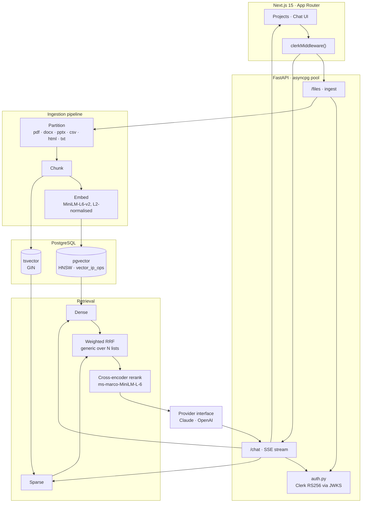
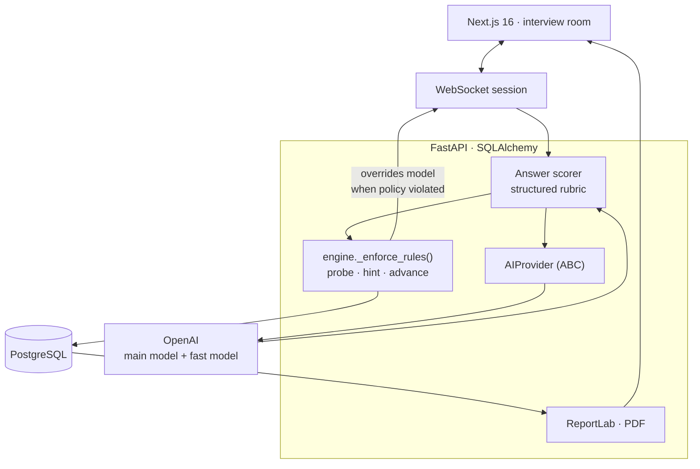
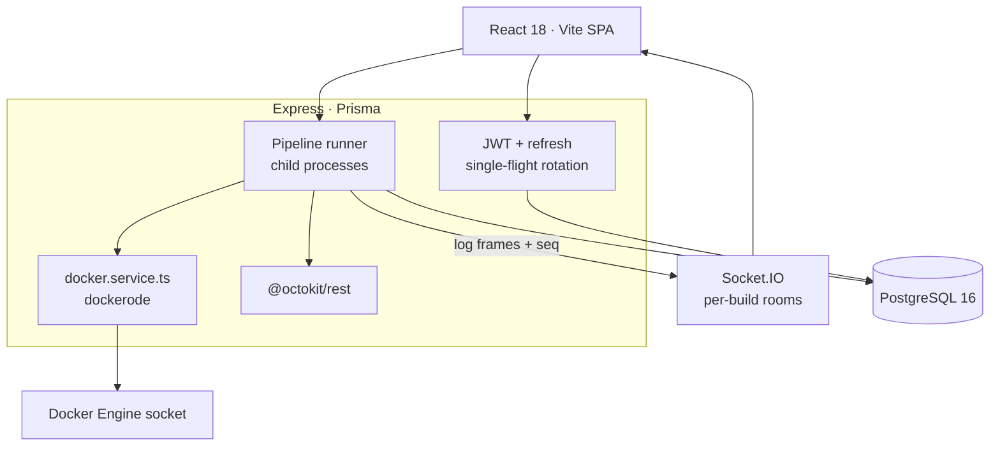
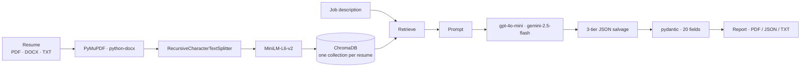
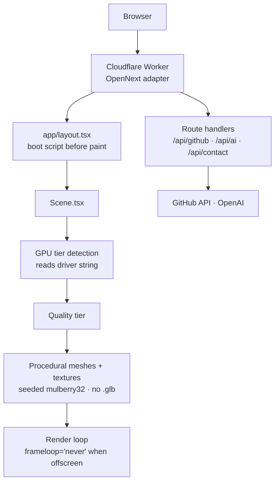

# Repository Playbook

Ready-to-paste README structure and architecture diagrams for each featured
project, plus the setup and troubleshooting notes for this profile repo.

Every diagram below was drawn from an audit that read the actual code — not
from the repository's own README. Where the two disagree, the code wins, and
the disagreement is listed under **Fix before a recruiter reads this**.

---

## The standard structure

Use this skeleton for every featured repo. Sections in *italics* are optional
only when genuinely not applicable.

```markdown
# Project Name

One sentence: what it does and for whom.


## Overview
Two short paragraphs. What problem it solves, and the one design decision
that makes it non-obvious.

## Features
- Concrete capability, not an adjective
- Another one

## Architecture
```mermaid
...
```

## Tech Stack
| Layer | Technology |
|---|---|
| Frontend | ... |
| Backend | ... |
| AI | ... |
| Database | ... |
| Infrastructure | ... |
| Testing | ... |

## Project Structure
Trimmed tree — directories and key files only, not every file.

## Getting Started
Prerequisites, then clone/install.

## Environment Variables
Point at `.env.example`. Never commit real values.

## Running Locally
Exact commands, verified by actually running them.

## API / Usage
*If it exposes one.*

## Screenshots
*If they exist.*

## Engineering Highlights
The 3–4 decisions worth defending in an interview.

## Future Improvements
Honest and specific.

## License
MIT — see [LICENSE](LICENSE).
```

Two rules that matter more than the structure:

1. **Never claim what isn't built.** Every featured repo currently overstates
   something. A reviewer who checks one claim and finds it false discounts the
   whole README.
2. **Separate built from planned.** Spendee's README already does this well;
   copy that pattern anywhere work is in progress.

---

## RAGForge — `RAGForge-Document_Search`

Self-hosted, multi-tenant RAG over private documents. Hybrid retrieval with
citation-backed streamed answers.



**Engineering highlights worth writing up**
- Weighted Reciprocal Rank Fusion written generically over N ranked lists rather
  than hardcoded to two.
- Inner product (`vector_ip_ops`) instead of cosine, made valid by L2-normalising
  at embed time — cheaper distance, same ranking.
- OR-joined `tsquery` construction, with an in-code comment explaining why
  `plainto_tsquery` was wrong for this use.

**Fix before a recruiter reads this**
- **Licensing — blocker.** No `LICENSE`, and the README itself notes the client
  scaffold came from a paid course "without an explicit grant." Resolve the
  provenance before adding any licence. Do not apply MIT to code you may not
  have the right to relicense.
- **IDOR** — `server/api.py:272-290` returns chunk contents without an ownership
  check.
- **SSRF** — URL ingestion in `server/routes/files.py` fetches arbitrary URLs.
- README says 8 partitioners; there are 6. README says `GET /health` reports the
  loaded embedding model; it does not.
- No tests, no CI, no Dockerfile — for a project described as "self-hosted",
  the missing container story is the first thing a reviewer will notice.

---

## InterviewPilot AI — `Interviewpilot_AI`

Adaptive mock interviewer. The model proposes; a server-side rule engine decides.



**Engineering highlights**
- The LLM is an advisor, not an authority: `_enforce_rules()` overrides the
  model's suggested next action when it breaks interview policy, so a
  hallucinated control decision cannot derail a session.
- `AIProvider` is an ABC; the OpenAI SDK is never imported outside its concrete
  implementation.
- Separate main and fast models per call site — question generation and the
  coach report don't need the same model.
- `otp.py` states its threat model in the docstring before the code.

**Fix first**
- README ends with "## License / MIT" — now backed by a real `LICENSE` file.
- `frontend/.env.local.example` is missing, so the README quick start
  (`cp .env.local.example .env.local`) fails on a clean clone. **Highest-value
  five-minute fix in the whole portfolio.**
- Stack line lists Redis; nothing uses it. `alembic` is pinned with no
  migrations directory.
- `docker-compose.yml` provisions only Postgres and Redis — `docker compose up`
  does not start the product.
- 20 tests pass and nothing runs them. Add CI.

---

## DevFlow — `Devflow`

Self-hosted CI/CD control plane driving the real Docker Engine and GitHub APIs.



**Engineering highlights**
- Docker log frame demultiplexing: without a TTY the Engine prefixes each line
  with an 8-byte header, and the stream is decoded frame by frame.
- CPU percentage computed the way `docker stats` computes it —
  `cpuDelta/systemDelta` scaled by online CPU count.
- Monotonic per-build sequence numbers on log lines, so a client reconnecting
  mid-build resumes without gaps or duplicates.
- A signed JWT used as the OAuth `state` parameter, carrying the linking user id.

**Fix first**
- **Default JWT secrets** in `server/src/config/env.ts:15-16` are usable in
  production. Fail startup instead of falling back.
- Unauthenticated Socket.IO room subscription — any client can join any build
  room and read its logs.
- Internal error messages are returned to clients.
- `vitest` is installed, `npm test` is wired, CI runs a test step, and **zero
  spec files exist**, so `npm test` exits 1. Either add tests or drop the step —
  a red CI badge is worse than none.
- `docker-compose.yml` provisions only Postgres; the two real multi-stage
  Dockerfiles are never orchestrated.

---

## ResumePilot — `ResumePilot`

Streamlit RAG resume analyser with a pluggable LLM provider.



**Engineering highlights**
- Three-tier JSON salvage — fenced block, raw parse, then repair — before
  pydantic validation, because a model asked for JSON returns almost-JSON often
  enough to matter.
- One ChromaDB collection per resume, so retrieval never bleeds between
  candidates.
- `requirements.txt` pins the CPU-only torch wheel index, with a comment saying
  why. Small detail; reviewers notice it.

**Fix first**
- A silent zero-score failure path: when analysis fails the UI shows 0 rather
  than an error.
- The reranker is close to a no-op — either make it real or stop advertising
  "retrieve → rerank."
- README lists Docker as a deployment target; there is no Dockerfile.
- OCR is described as scaffolded; it is unreachable.
- 20 tests exist and 12 run with no API key — a 30-line pytest workflow earns a
  green badge immediately.

---

## DevVerse AI — `Devverse_AI`

Procedural three.js portfolio on Cloudflare Workers.



**Engineering highlights**
- Every mesh and texture is generated in code — no `.glb` assets in the repo.
- Quality tier chosen by reading the real GPU driver string from a throwaway
  WebGL context.
- All randomness from a seeded PRNG, so the scene is byte-identical each load.
- The render loop halts when the hero scrolls out of view.

**Fix first**
- Both public API routes are unauthenticated with no rate limiting — the single
  most important fix, since one of them calls a paid API.
- `api/contact/route.ts` writes the sender's name, email and message to logs.
- README lists GSAP; it isn't a dependency. The theme switcher persists a value
  nothing reads.

---

## Spendee — `Spendee`

Android + Spring Boot monorepo, actively in development.

> Not independently audited in this pass — the audit agent did not return.
> Treat the description below as carried over from the existing README rather
> than code-verified.

Its README already separates built from planned, which is the right pattern.
Keep that, and add the architecture diagram once the module boundaries settle.

---

## Setup and troubleshooting

### Where things live

```text
Kushwaha-Hemant/                  ← the profile repo (special: name == username)
├── README.md                     ← renders on github.com/Kushwaha-Hemant
├── assets/
│   ├── portrait-boot.webp        ← profile hero animation
│   ├── portrait-{square,wide,small}.{webp,gif,mp4}
│   ├── engineering-focus.svg
│   ├── developer-journey.svg
│   └── make_charts.py            ← regenerates both SVGs
├── ascii-portrait/               ← the portrait generator
└── .github/workflows/snake.yml   ← contribution snake, every 12h
```

### Regenerating

```bash
# charts
python assets/make_charts.py

# portrait — preview first, it takes ~1s
python ascii-portrait/generate.py --image path/to/photo.png --preview
python ascii-portrait/generate.py --image path/to/photo.png --only boot
```

### Committing

```bash
git add -A
git commit -m "Update profile"
git push origin main
```

The profile page updates within seconds. GitHub caches images aggressively
through its `camo` proxy — a changed asset at the same URL can take a few
minutes, or a hard refresh, to appear.

### Troubleshooting

| Symptom | Cause | Fix |
|---|---|---|
| Mermaid shows as a code block | Fence isn't exactly ```` ```mermaid ```` | Check the language tag; GitHub emits `lang="mermaid"` when correct |
| SVG doesn't render | External font/CSS reference | SVG in an `` blocks all external requests — inline everything |
| Animation doesn't play | Rendered as a static frame | Confirm the file is animated: `python -c "from PIL import Image;print(Image.open('a.webp').n_frames)"` |
| Image is stale | `camo` cache | Hard refresh, or change the filename |
| Chart looks wrong in light mode | Theme-dependent colours | These charts are opaque dark cards by design; keep them self-contained |
| Contribution graph empty | Commit email not on the account | See the note in the profile README history — add and verify the email |
